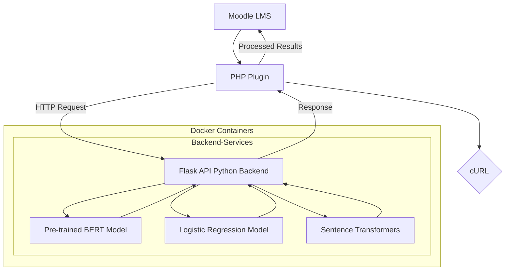
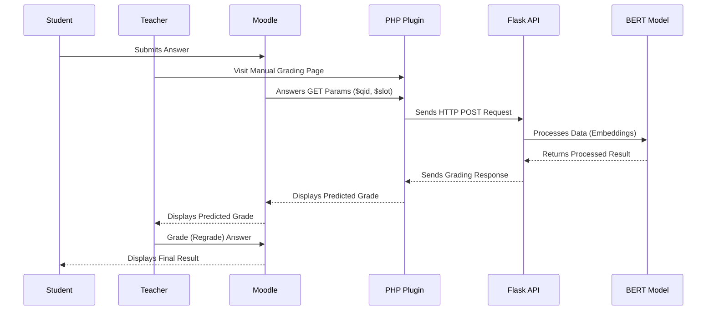
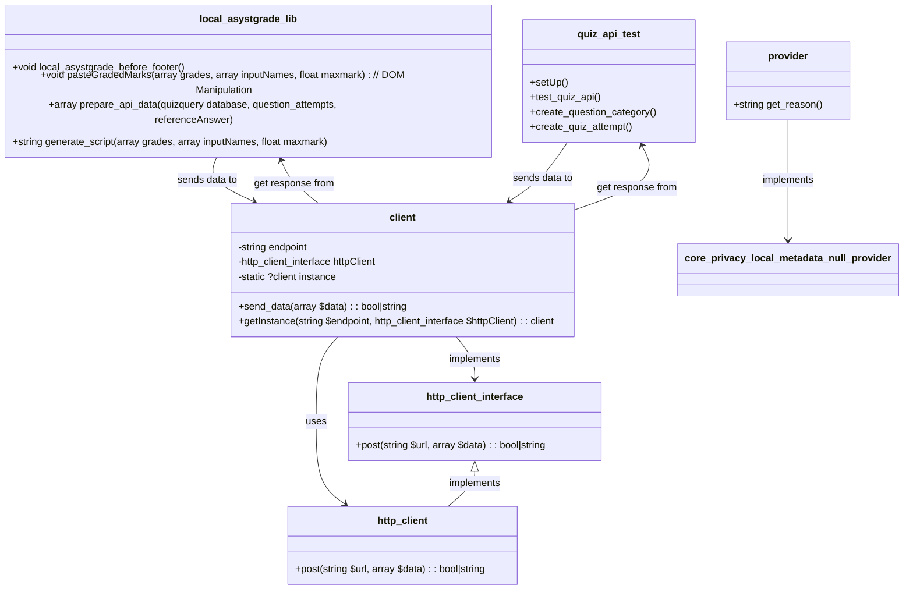
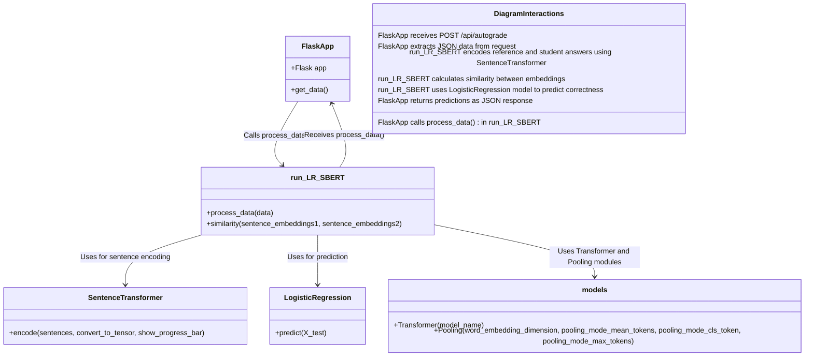

# ASYSTGRADE Moodle Plugin

This plugin, is designed to facilitate teachers’ activities in evaluating students’ short answers. 
The plugin uses the ASYST grading [script](https://transfer.hft-stuttgart.de/gitlab/ulrike.pado/ASYST) modified to function as a web endpoint.
The plugin requires the ASYST ML Backend to be isolated in a standalone Docker container accessible via the local network or the Internet (you could set it on plugin settings page).
ASYSTGRADE Moodle Plugin runs each time the teacher reaches some manual grading page (a part of [Essay auto-grade plugin](https://moodle.org/plugins/qtype_essayautograde) maintained by Gordon Bateson)!

The first time the plugin makes a request to the ASYST ML backend, there is a delay due to the loading of the BERT model in the Flask container.

This solution is part of the Master’s Thesis titled “Integration of a Machine Learning Backend into Assessment Processes in a PHP-based Educational Environment” at the University of Applied Sciences Stuttgart, within the Software Technology course, 2024, by Artem Baranovskyi.

## Plugin and ASYST ML Backend Interaction Concept


## Description of Use Case processes at Sequence Diagram


## Plugin components' Diagram


## ML Backend Components' Diagram


## How to roll out the solution
### Install locally ASYST Backend on Flask
It is not necessary to build full solution if you want just use the plugin at your existing Moodle LMS. 

To build and start the Flask ML ASYST microservice, run:

~~~bash
./local/asystgrade/deploy_backend.sh
~~~

To run prebuilt Flask ML ASYST microservice
~~~bash
./local/asystgrade/start_backend.sh 
~~~
or go to the Moodle folder with cd then enter to ./local/asystgrade/ and run
~~~bash
docker-compose up flask -d
~~~
Asyst ML Backend could be hosted and used not only at local server, but at some remoted services.
In this case it is possible to change an API address from http://127.0.0.1:5001/api/autograde to another.


If ASYST ML microservice is running, the grade will appear at every student's answer.


The structure of request to ASYST ML Backend: 
~~~JSON
{
  "referenceAnswer": "The reference answer",
  "studentAnswers": [
    "First Student's Answer",
    "Second Student's Answer"
  ]
}
~~~
**Explanation:**

**referenceAnswer**: This is the model answer provided by the teacher. It includes detailed explanations and grading criteria.

**studentAnswers**: This array contains the answers submitted by students. Each answer is evaluated against the reference answer.

The structure of response from ASYST ML Backend:
~~~JSON
[
  {
    "predicted_grade": "incorrect"
  },
  {
    "predicted_grade": "correct"
  }
]
~~~
**Explanation:**

**predicted_grade**: The response includes a predicted grade for each student answer, indicating whether it is “correct” or “incorrect”.

Similarity of any text now could be checked with a curl request:
```curl
curl -X POST http://127.0.0.1:5001/api/autograde -H "Content-Type: application/json" -d '{
    "referenceAnswer": "Multithreading improves the performance of a program because the processor can switch between different tasks, utilizing waiting times in one thread to process other threads. This allows for more efficient use of CPU resources.",
    "studentAnswers": [
        "Multithreading enhances a program’s performance by allowing the CPU to handle multiple tasks simultaneously. This means that while one thread is waiting for data, the CPU can process other threads, leading to more efficient use of processing power.",
        "Multithreading slows down the performance of a program because the processor gets overloaded with too many tasks at once."
    ]
}'

```
On troubleshooting during API fetch could occur CORS access errors with 500 server response.
To fix it usually necessary to set CORS at used virtual hosts like this:
~~~apacheconf
# /etc/apache2/apache2.conf
<Directory /var/www/html/moodle> 
    Options Indexes FollowSymLinks 
    AllowOverride All 
    Require all granted
    
    <IfModule mod_headers.c> 
        Header set Access-Control-Allow-Origin "*" 
        Header set Access-Control-Allow-Methods "GET, POST, OPTIONS, DELETE, PUT" 
        Header set Access-Control-Allow-Headers "Content-Type, Authorization" 
    </IfModule>
</Directory>
~~~

## Running Integration Test
To run only the plugin’s test, execute in the project’s CLI (inside the Moodle folder):
~~~bash
vendor/bin/phpunit --testsuite local_asystgrade_testsuite
~~~

To run tests please set PHPUnit. For that set params at your moodle config.php:
~~~php
$CFG->phpunit_dataroot = '/path/to/your/phpunit_dataroot'; 
$CFG->phpunit_prefix = 'phpu_';
~~~
Then run:
~~~bash
php admin/tool/phpunit/cli/init.php
~~~